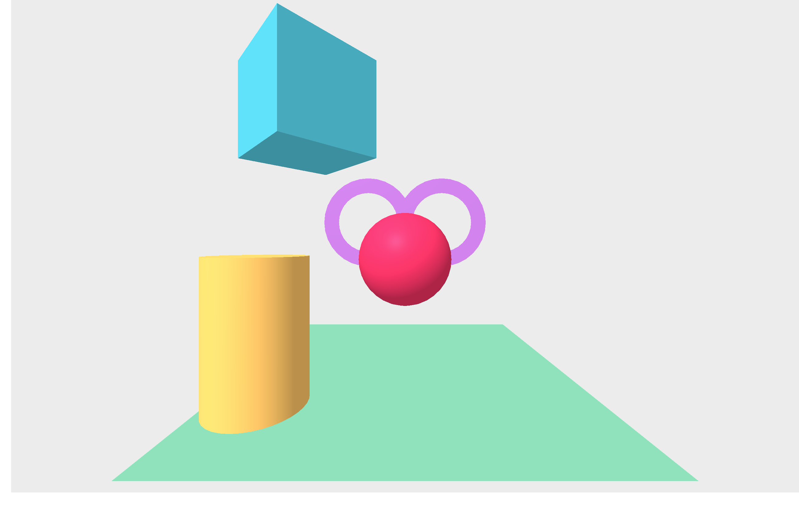
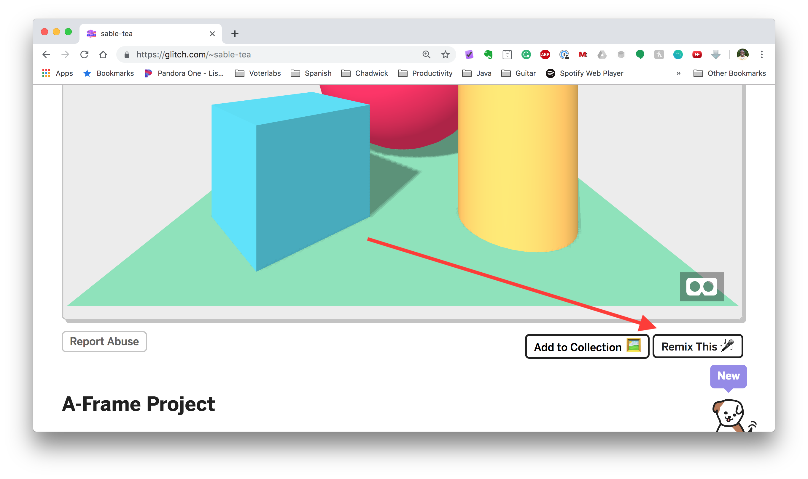

# Lesson 1 - Getting Started

In this module you will set up an account in Glitch and be introduced to A-frame.

## Set Up Account in Glitch

We first need to set up an account in Glitch. Go to https://glitch.com/ and click Sign-In in the top right corner. Sign in with an appropriate account (I would recommend Google).

## Remix your first project 

Let's get right to coding! Glitch is an amazing platform that allows you to remix other developer's code very easily. 

You are going to take a starter project and remix it to look like the below image

First open this link in a new tab https://glitch.com/~sable-tea scroll down and click Remix your own. 

Open the index.html file. Spend a few minutes exploring the code. See if you can figure out what each line of code BEFORE MODIFYING. 

### Challenge Pt 1

Your first challenge is to make your app look like the image below

Tip: To make the rings you'll need to use [a-ring](https://github.com/aframevr/aframe/blob/master/docs/primitives/a-ring.md). 

Tip: To find the color you can use Google's [Web Color Picker](https://www.google.com/search?q=web+color+picker) to help

### Challenge Pt 2

After you've recreated the image above, now create your own scene. Your scene should use at least 3 primitives. You can find the list of A-frame primitives [here](https://github.com/aframevr/aframe/tree/master/docs/primitives)

