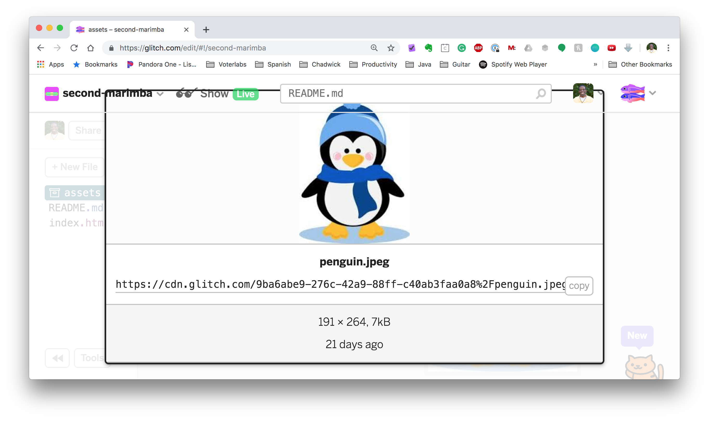
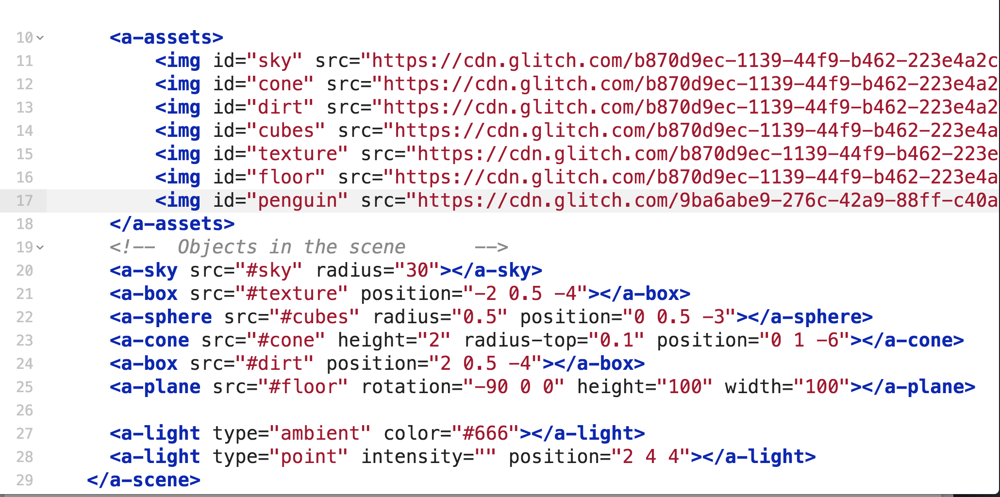
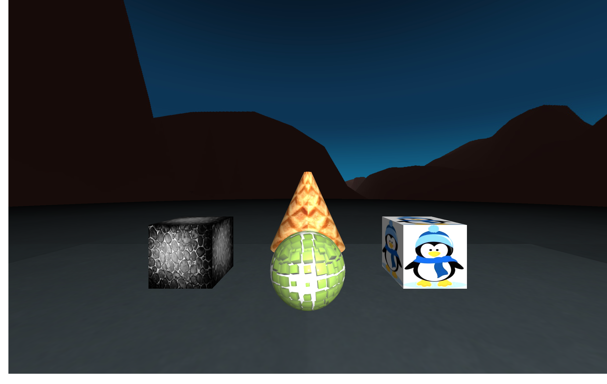

# Lesson 2 - Working with Images

In this lesson, you'll learn to work with images in A-frame. 

## Remix your second project

First, open this link in a new tab https://glitch.com/~second-marimba scroll down and click Remix your own. 

Again, take a look at the code and see if you can figure out what's going on. One thing you should notice is the A-frame asset management system. This allows us to keep all of the assets that are part of our scene organized. 

### Part I - Add penguin image to cube

So let's add a penguin image to one of our cubes.

First, go to `assets` and find the penguin image. When you click it on it you should get a screen like this: 

Click the copy button. Click anywhere outside the pop-up window to exit it.

Go back to your index.html and add another `img` tag to the a-assets. You'll set the id to `penguin` and the src to the link you copied. It should look like this:

Now change the second a-box attribute (should be on line 24) from `#dirt` to `#penguin`. 

When you go to your app the box on the right should have a picture of penguin on all sides.

You'll notice it's on all sides. Currently, there is no easy way to make an image appear on one side of a primitive in A-frame. This is because the primary use of adding an image to a primitive is to provide a texture to it (e.g. dirt). If you want to just add an image to display in your scene you should use [a-image](https://github.com/aframevr/aframe/blob/master/docs/primitives/a-image.md). 

## Challenge

Before starting this challenge you might want to think of a theme for your scene (e.g. space, forest, desert, etc.). Also you'll be adding your own images to the scene. Make sure the image is downloaded to your computer. In your app, go to assets, click `Add Asset` and upload your image to Glitch.

1. Insert a different sky image. You'll need a 360 image to make a decent sky. You can find some at this [site](https://www.flickr.com/groups/360degrees/pool/with/49029956007/) or by doing a Google Image Search of "360 degree images".

2. Change the objects in the scene and/or textures to match your new sky. You can find some textures at this [site](https://www.pexels.com/search/texture/) or by doing a Google Image Search of "texture jpg".

Bonus: Lighting makes a huge difference in a VR scene. Look at the [documentation](https://github.com/aframevr/aframe/blob/master/docs/primitives/a-light.md) for lighting and see if you can use lighting to bring attention to certain objects/areas of your scene.
